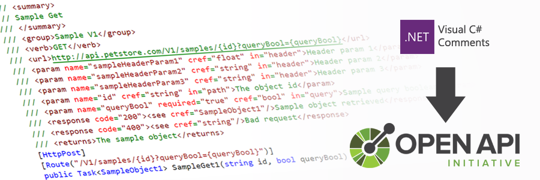

[](https://ci.appveyor.com/project/MicrosoftOpenAPINETAdmin/openapi-net-csharpcomment/branch/master)



# C# Comment Reader [Preview]
[Disclaimer: This repository is in a preview state. Expect to see some iterating as we work towards the final release candidate slated for mid 2018. Feedback is welcome!]


### Welcome!
This reader is the first by-product of Microsoft's supported base [OpenAPI.NET](http://aka.ms/openapi) object model. This reader is designed to convert your native C# comments from your API code into a OpenAPI document (V2 or V3). All you need to do is follow a simple annotation schema for your API controller comments, and you automatically get all the benefits of the OpenAPI and it's related Swagger tooling.

### Annotations (C# Comments)
We've made an effort to develop an annotation model that maps very closely to the native .Net comment structure for the C# language. In general, the below image describes the general concept of how this utility parse your C# comments and generate your OpenAPI.NET document.


Consult our [WIKI](https://github.com/Microsoft/OpenAPI.NET.CSharpComment/wikihttps://github.com/Microsoft/OpenAPI.NET.CSharpComment/wiki) for specific guidence and examples on how to annotate your controllers.

### Mechanics
Two things are needed to use this reader.
- The "XML documentation file" from your MSBuild.exe output
- Any DLL's that contain the data types of your API's request/response contracts.

After you've corrrectly annotated your C# code, you'll need to build your solution and then retrieve the output XML file where MSBuild.exe aggegates the projects comments. This file is what this utility will use to convert your comments into an OpenAPI.NET object.


### Simple Example Code
Here's a simple exampled of how you'd use this reader. The utility takes in two lists. The first shown below is the paths to your post-MSbuild.exe xml documentation files. The second being the paths to any DLL's that have classes that you reference in those XML comments.

For example, if you have an annotation for a response type as follows:
```
/// <response code="200"><see cref="SampleObject1"/>Sample object retrieved</response>
```
You'd need to include the path to the .dll that contains the SampleObject1 class. 

Generating your OAI document should look something like this:
```
                "Standard valid XML document",
                // pass in XML annotation files
                new List<string>
                {
                    Path.Combine(InputDirectory, "Annotation.xml"),
                    Path.Combine(InputDirectory, "Microsoft.OpenApi.CSharpComment.Reader.Tests.Contracts.xml")
                },
                // pass in paths to DLL's where data contracts live
                new List<string>
                {
                    Path.Combine(
                        InputDirectory,
                        "Microsoft.OpenApi.CSharpComment.Reader.Tests.SampleApis.dll"),
                    Path.Combine(
                        InputDirectory,
                        "Microsoft.OpenApi.CSharpComment.Reader.Tests.Contracts.dll")
                },
                OpenApiSpecVersion.OpenApi3_0, 9, Path.Combine(
                    OutputDirectory,
                    "OAIOutput.Json")
```
In this example the generated OAIOutput.json should contain a valid V3 OID document for your API based on the C# comments and contract dll you included. This example and many others can be run in the test suite included in this repo [here](test/Microsoft.OpenApi.CSharpComment.Reader.Tests/OpenApiDocumentGeneratorTests/OpenApiDocumentGeneratorTest.cs#L671).

# Contributing
This project welcomes contributions and suggestions.  Most contributions require you to agree to a
Contributor License Agreement (CLA) declaring that you have the right to, and actually do, grant us
the rights to use your contribution. For details, visit https://cla.microsoft.com.

When you submit a pull request, a CLA-bot will automatically determine whether you need to provide
a CLA and decorate the PR appropriately (e.g., label, comment). Simply follow the instructions
provided by the bot. You will only need to do this once across all repos using our CLA.

This project has adopted the [Microsoft Open Source Code of Conduct](https://opensource.microsoft.com/codeofconduct/).
For more information see the [Code of Conduct FAQ](https://opensource.microsoft.com/codeofconduct/faq/) or
contact [opencode@microsoft.com](mailto:opencode@microsoft.com) with any additional questions or comments.